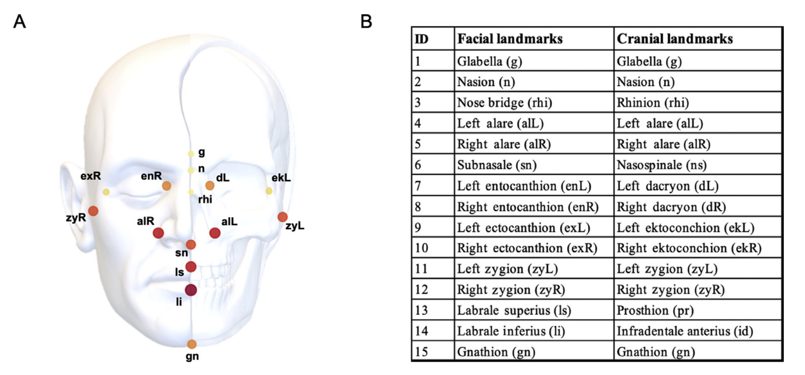
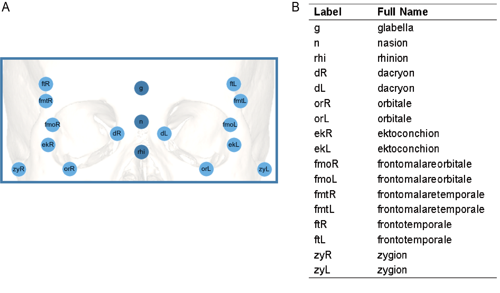

# Automated Localization of Skull and Face Landmarks (ALoSFL v2.0)

### Introduction

**ALoSFL** is a Python-based command line tool for localization of both
facial and cranial landmarks from head CT images by implementing the
multi-atlas registration (MAS) and label fusion algorithms (Zhuang,
Arridge et al. 2011). The pipeline is described in our recent paper
shown in **Citation** below.

The current version of the software is only available for Windows! The
Linux version will be launched in the near future.

### Get Started

To run ALoSFL, you will need to have Python 3.6 installed with the
following packages: - `numpy (>=1.17.0)` - `pandas (>=0.23.0)` -
`SimpleITK` - `nibabel 2.3.3` - `argparse 1.1`

ALoSFL can be downloaded by cloning the github repository:

`git clone https://github.com/happyqianwei/ALoSFL2.0.git`

`cd ALoSFL`

To test that the tool has been successfully installed, simply run:

`python ./main.py -h`

To run the software, simply run:

`python ./main.py --list_test_images [path] --list_atlas_images [path] --list_landmarks [path] --tmp [path] --output [path]`

More options:

If you just want to resample the test image and average the results of
the top 10 atlas proposed when doing label fusion, then you can run:

`python ./main.py --resample test --fusion 2 --top_n 10`

We have provided an example of toy data to help you walk through the use
of ALoSFL. Considering privacy issue, the example images are
desensitized and synthesized and the landmarks are randomly generated.
Our example just guide you to understand the format of input data and
the pipeline.

To play with the example, you can simply run:

`python ./main.py`

More details can be found in the help list by typing:

`python ./main.py -h`

The complete parameters are listed below:

`python main.py [-h] [--dicom2nii {atlas, test, both, none}] [--resample {atlas, test, both, none}] [--list_atlas_images [path]] [--list_landmarks [path]] [--list_test_images [path]] [--fusion {1, 2, 3, 4}] [--output [path]] [--tmp [path]] [--top_n N] [--delete {T,F}]`

### Data Preparation

Before running the software, please prepare all the data and configure
files as follows. The example data is for your reference.

##### Data folder

-   Atlas images that are reference images used for registration
-   Test images that are required to localize facial and cranial
    landmarks
-   Landmark files contain the coordinates of landmarks for each atlas
    image

***To be noted*** - DICOM and Nifti encode space differently. Our
software requires the coordinate system of landmark inputs in **Nifti**
format. Please make sure before running the software. More information
can be found
[here](https://www.nitrc.org/plugins/mwiki/index.php/dcm2nii:MainPage#Spatial_Coordinates).

##### Configure folder

-   List of atlas image path
-   List of test image path
-   List of landmark path

### Customizing Landmark Protocols (Multi-Protocol Flexibility)

ALoSFL natively supports seamless switching between different
landmarking protocols based on your specific research focus or imaging
fields of view (FOV), requiring **zero modifications to the core source
code**.

To demonstrate this architecture, we provide the text-based metadata
layout templates for two distinct landmarking profiles in the
`example/landmarks/` directory (note: To protect the privacy of clinical
data, our sample data are all simulated and are mainly used to provide
reference for data formats):

1.  **2022 Full-Face Profile (15 Landmarks)** (see
    `example/landmarks/*fullface_2022.txt`): Optimized for full-head CT
    scans, tracking global features of the skull and full face
    (including the mandible/chin) as detailed in *Qian et al., Journal
    of Genetics and Genomics, 2022* [1].
2.  **2026 High-Density Midface Profile (17 Landmarks)** (see
    `example/landmarks/*midface_2026.txt`): The protocol utilized in
    this study, optimized for retrospective clinical cohorts with
    restricted FOVs (e.g., upper-head scans where the mandible is
    cropped). It introduces 4 pairs of high-density bilateral midface
    landmarks (`or`, `fmo`, `fmt`, `ft`) to capture fine-grained local
    morphology within a smaller region. More details can be found in *Li
    et al., Journal of Genetics and Genomics, 2026 (Under review)* [2].

Two complete anatomical schematics of skull landmark configurations can
be found below. 

### Citation

If you use the ALoSFL software, please cite:

1.  *Qian et al., Genetic evidence for facial variation being a
    composite phenotype of cranial variation and facial soft tissue
    thickness. Journal of Genetics and Genomics. 2022. DOI:
    <https://doi.org/10.1016/j.jgg.2022.02.020>*
2.  *Li et al., Decoupling skeletal and soft-tissue genetic effects in
    human craniofacial morphology. Journal of Genetics and
    Genomics. 2026. Under review*

### Tip

If you can not get correct output, you can try to change input landmark
from (x, y, z) to (-x, -y, z). You may use the world units(ITK) instead
of world units(NIFTI). They are different.

### Support

We will help address the problems that you may encounter when using
ALoSFL. Please feel free to contact us if you have any question.

Email: [wqian\@sinh.ac.cn](mailto:wqian@sinh.ac.cn);
[18110980009\@fudan.edu.cn](mailto:18110980009@fudan.edu.cn)
